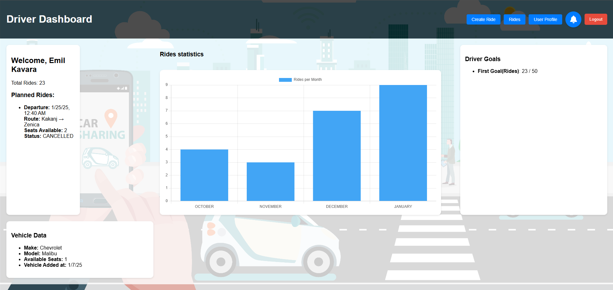

# Passenger Sharing System (PSS)

Passenger Sharing System (PSS) is an application designed to connect passengers and drivers within academic communities, such as universities and colleges, enabling easy organization of shared rides. This is a personal project created by a junior programmer to meet the needs for economical, flexible, and environmentally friendly transportation.

---

## Table of Contents
- [Project Overview](#project-overview)
- [Key Features](#key-features)
- [Technologies](#technologies)
- [Installation and Setup](#installation-and-setup)
- [Screenshots](#screenshots)
- [Contributions](#contributions)
- [License](#license)

---

## Project Overview

PSS enables:
- **Passengers**: Search for available rides, reserve seats, and communicate with drivers.
- **Drivers**: Post rides, manage reservations, and review feedback.
- **Administrators**: Manage users, monitor activities, and maintain security standards.

The goal is to create an eco-friendly, economical, and easy-to-use platform tailored for the academic community.

---

## Key Features

- **User Registration and Login**: Simple access through username and password.
- **Profile Creation and Editing**: Add basic information, preferences, and reviews.
- **Ride Search and Reservation**: Filter by location, time, and driver ratings.
- **Ride Management**: Create, edit, and cancel rides.
- **Ratings and Feedback**: Leave reviews after each ride.
- **Notifications**: Alerts about ride and reservation statuses.

---

## Technologies

Frontend:
- **Angular** (JavaScript)

Backend:
- **Java Spring Framework**

Database:
- **PostgreSQL**

API:
- **RESTful**

Design:
- Responsive design suitable for web browsers and desktop devices.

---

## Installation and Setup

### Backend
1. Clone the `pss-be` repository:
   ```bash
   git clone https://github.com/EmilKavara/pss-be.git
2. Install dependencies:
    ```bash
   ./mvnw install
3. Start the server:
    ```bash
   ./mvnw spring-boot:run

### Frontend
1. Clone the `pss-fe` repository:
    ```bash
   git clone https://github.com/EmilKavara/pss-be.git
2. Install dependencies:
    ```bash
    npm install
3. Start the application:
    ```bash
    ng serve

## Screenshots

| Name                         | Description                                                                     | Image                                                 |
|------------------------------|---------------------------------------------------------------------------------|-------------------------------------------------------|
| **Driver Dashboard**         | Displays driver's ride statistics, planned rides, vehicle info and driver goals |  |
| **Passenger Dashboard**      | Displays available rides.                                                       |      |
| **Register**                 | Registration page.                                                              |                  |
| **Login**                    | Login page.                                                                     |                        |
| **Create Ride**              | Displays create ride form.                                                      |            |
| **Cancel or Delay Ride**     | List of all active rides that can be delayed or cancelled.                      |            |
| **Handle Ride Request**      | Displays all requests and their information.                                    |      |
| **User Profile**             | Displays all users information.                                                 |          |
| **Email Delay Notification** | Email that is sent when there is delay for ride.                                |                   |

